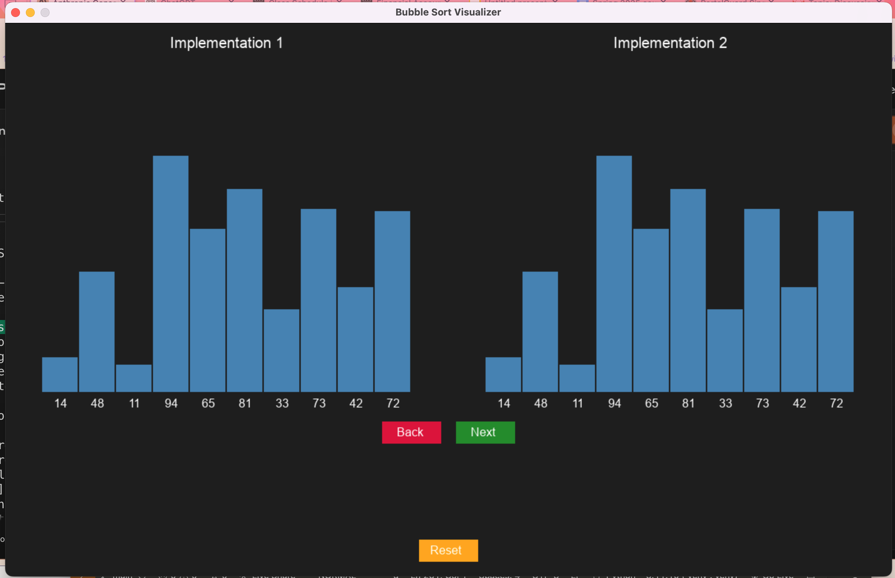

# Bubble Sort Visualizer

A side-by-side visual comparison of two different implementations of the Bubble Sort algorithm using Python and Pygame.




## Table of Contents

1. [Features](#features)
2. [Requirements](#requirements)
3. [Installation](#installation)
4. [Usage](#usage)
   - [Running the Visualizer](#running-the-visualizer)
   - [Controls](#controls)
5. [Keybindings](#keybindings)
6. [Project Structure](#project-structure)
7. [Images](#images)
8. [License](#license)

## Features

- **Side-by-Side Comparison**: Visualize two different implementations of the Bubble Sort algorithm simultaneously.
- **Step-by-Step Execution**: Navigate through the sorting process one step at a time.
- **Visual Highlights**:
  - Bars representing array elements change color during comparisons and swaps.
  - Comparison expressions displayed with color-coded underlining to indicate true (green) or false (red).
- **User-Friendly Controls**: Use keyboard or mouse controls to navigate through the sorting steps.
- **Customizable Array**: Easily modify the array size and values within the code.

## Requirements

- Python 3.x
- Pygame 2.6.1

You can install the required packages using the requirements.txt file provided.

## Installation

### Step 1: Clone the Repository
```bash
git clone https://github.com/yourusername/bubble-sort-visualizer.git
cd bubble-sort-visualizer
```

### Step 2: Create a Virtual Environment

Create a virtual environment to manage dependencies.

On Windows:
```bash
python -m venv venv
venv\Scripts\activate
```

On macOS and Linux:
```bash
python3 -m venv venv
source venv/bin/activate
```

### Step 3: Install Dependencies
```bash
pip install -r requirements.txt
```

*Note: Ensure that you have Python and pip installed on your system. If you encounter any issues, refer to the Python documentation for installation guides.*

## Usage

### Running the Visualizer

After activating the virtual environment and installing the dependencies, run the visualizer script.
```bash
python bubble_sort_visualizer.py
```

### Controls

Navigate through the sorting process using keyboard keys or mouse clicks.

#### Keyboard Controls
- **Next Step**: Press Space to advance to the next step in both visualizers simultaneously.
- **Previous Step**: Press B to go back one step in both visualizers.

#### Mouse Controls
- **Next Step**: Click the Next button centered below the visualizations.
- **Previous Step**: Click the Back button centered below the visualizations.
- **Reset**: Click the Reset button at the bottom center to generate a new random array and reset both visualizers.

## Keybindings
- **Spacebar**: Advance to the next step.
- **B Key**: Go back to the previous step.

## Project Structure
```
bubble-sort-visualizer/
├── bubble_sort_visualizer.py
├── requirements.txt
├── README.md
└── images/
    └── visualizer_screenshot.png
```
- `bubble_sort_visualizer.py`: The main script containing the visualizer code.
- `requirements.txt`: A file specifying the required Python packages and their versions.
- `README.md`: This README file.
- `images/`: Directory containing images for the README.

## Images

### Visualizer Screenshot


## License

This project is licensed under the MIT License.